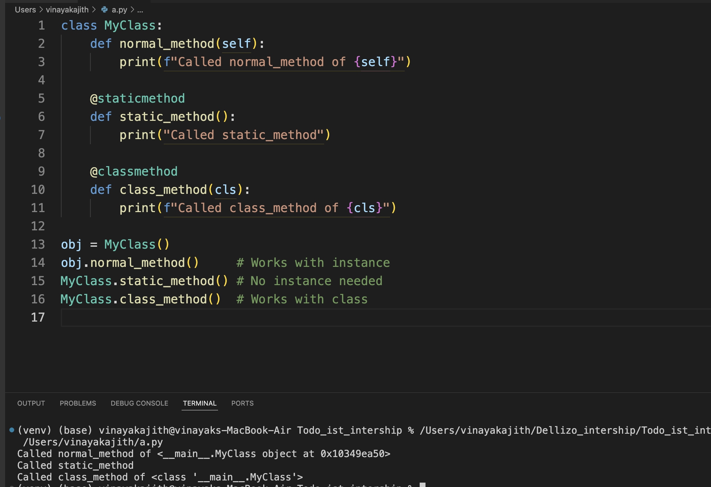

# Bonus Task: Async URL Fetcher

This script uses Python’s `aiohttp` and `asyncio` libraries to fetch multiple URLs concurrently.  
It measures the response status and time taken for each URL and prints the results.

---

### Screenshot of Output

The screenshot below shows the script running in the terminal, displaying the status codes and response times for each URL fetched asynchronously.



---

## How to run

1. Install dependencies:  
   ```bash
   pip install aiohttp
