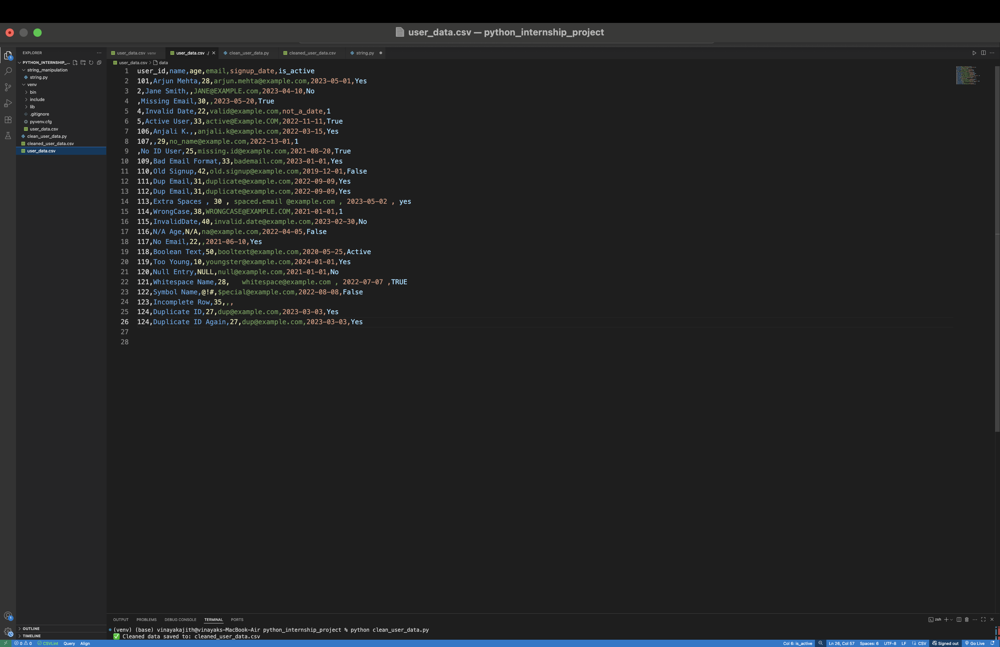
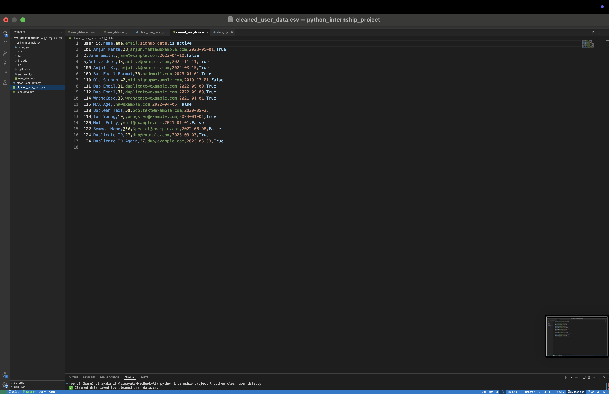
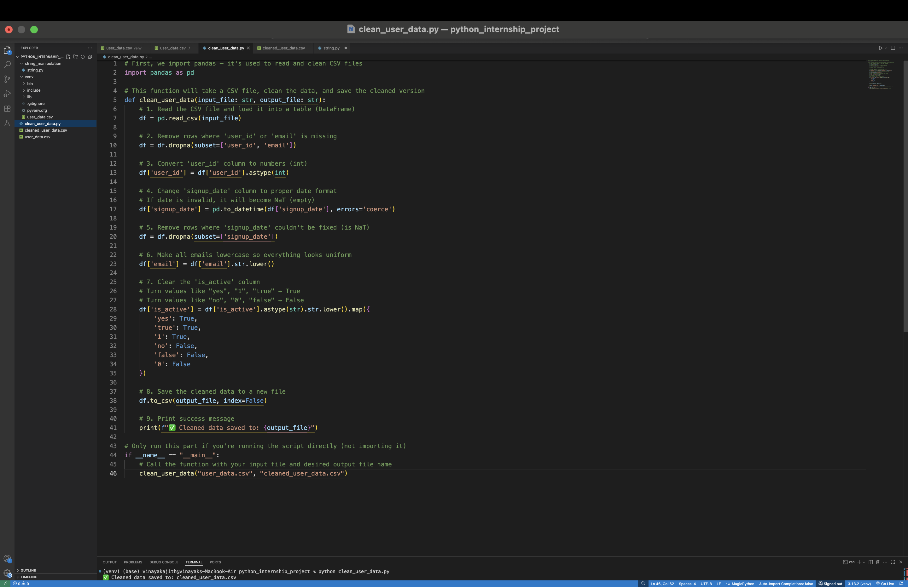

# Data Cleaning Task

This script reads the CSV file `user_data.csv`, cleans the data by:

- Removing rows missing user ID or email
- Converting data types properly
- Standardizing emails to lowercase
- Saving the cleaned data as `cleaned_user_data.csv`





## How to run

```bash
python data_cleaning.py
