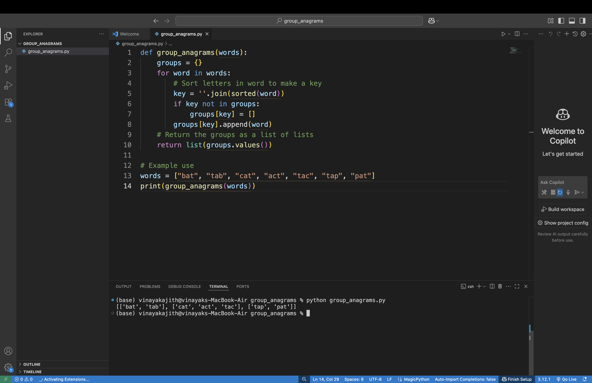

# Group Anagrams Task

This script groups words that are anagrams of each other.

## How it Works

- Takes a list of words.
- Sorts each word’s letters to find matching groups.
- Groups words with the same sorted letters together.

  ## Sample Output Screenshot




## How to Run

```bash
python group_anagrams.py
