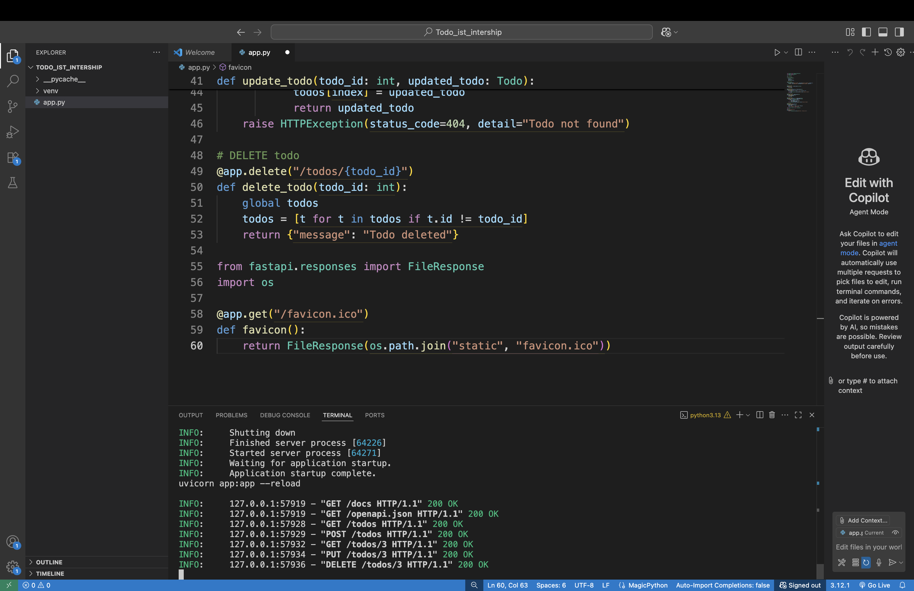
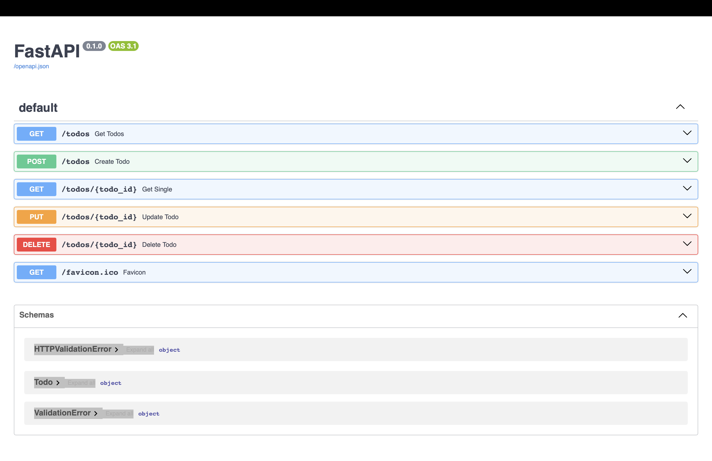
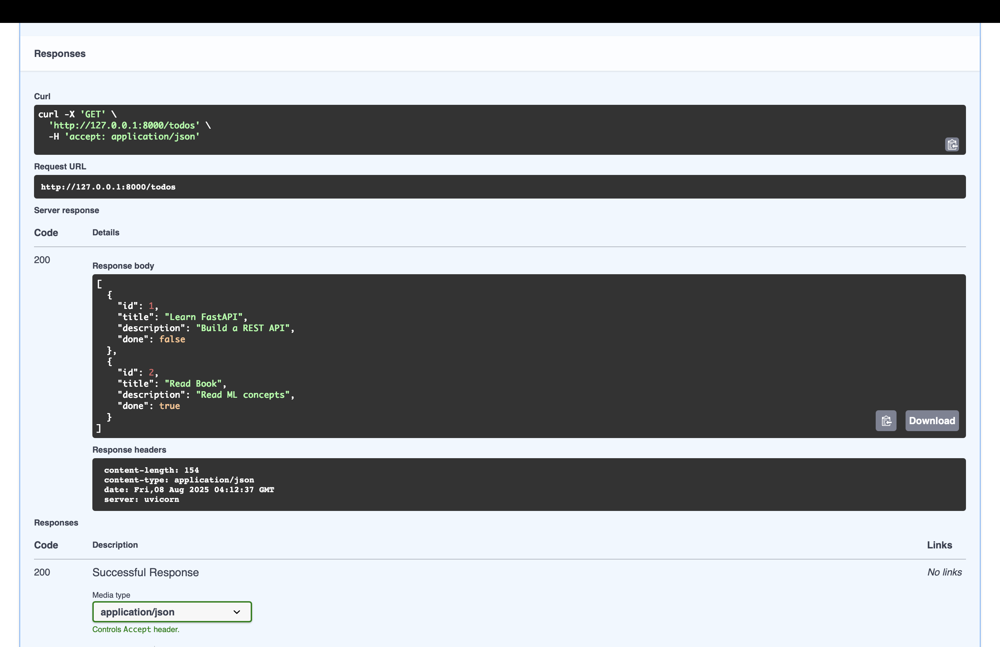
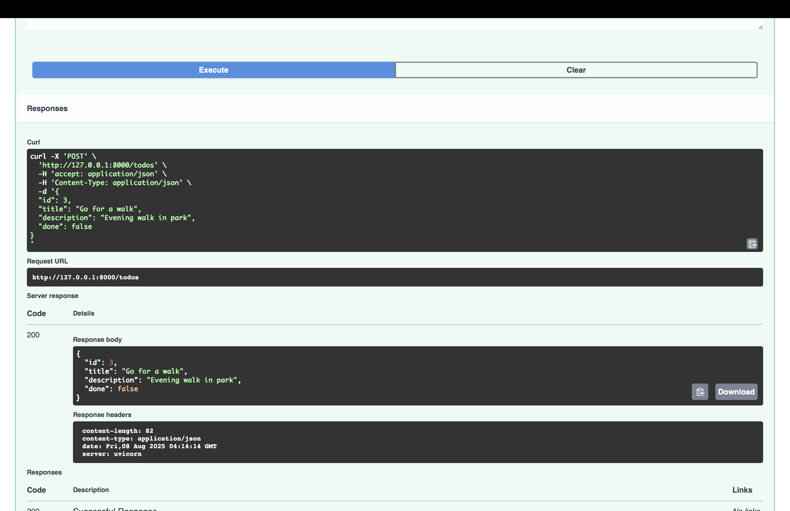
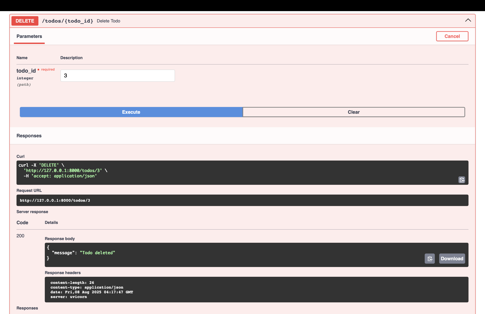

# Todo List API

This is a simple REST API built with FastAPI to manage a Todo list.

## Features

- List all todos
- Create a new todo
- Get a single todo by ID
- Update a todo by ID
- Delete a todo by ID

## Endpoints

| Method | Endpoint       | Description               |
|--------|----------------|---------------------------|
| GET    | /todos         | List all todos            |
| POST   | /todos         | Create a new todo         |
| GET    | /todos/{id}    | Get a todo by ID          |
| PUT    | /todos/{id}    | Update a todo by ID       |
| DELETE | /todos/{id}    | Delete a todo by ID       |

## Screenshots

### FastAPI Server Terminal Output  


### Swagger UI Documentation  


### GET /todos Test  


### POST /todos Test  


### DELETE /todos Test  



## How to Run

1. Install dependencies:

```bash
pip install fastapi uvicorn
uvicorn main:app --reload


